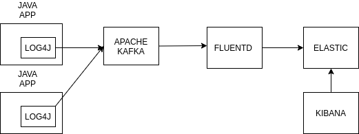

### Efk kafka logging 

#### Farklı mikroservislerden gelen logları kafka üzerinden geçirip elastic üzerinde günlük  olarak istenen indexlerde loglama

 

#### Kütüphaneler
* [Spring boot ](https://github.com/spring-projects/spring-boot) - create stand-alone, production-grade Spring based Applications
* [Log4j](https://github.com/apache/log4j) - Apache Log4j is a Java-based logging utility
* [Apache Kafka](https://github.com/apache/kafka) -  stream-processing software platform
* [Elastic](https://github.com/elastic/elasticsearch) - A Distributed RESTful Search Engine

* [Fluentd](https://github.com/fluent/fluentd) - collects events from various data sources and writes them to files

[]